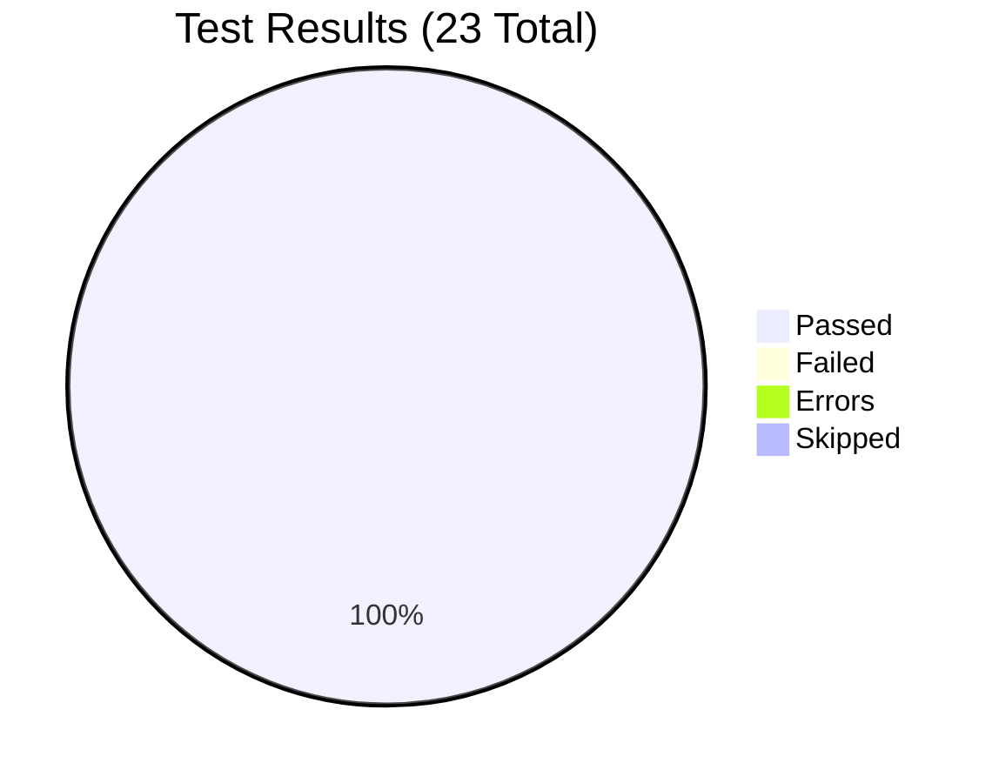
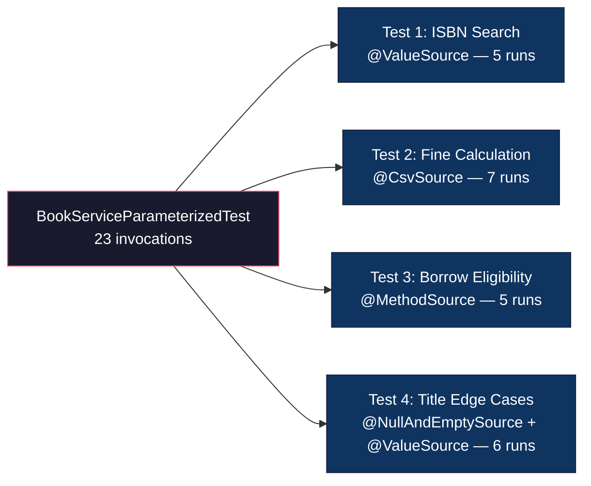

# JUnit 5 Parameterized Testing — Implementation Report

**Module:** SE3112 — Advanced Software Engineering  
**Student:** Janeesha  
**Feature:** JUnit 5 Parameterized Testing  
**System Under Test:** Library Management System (LMS)  
**Date:** 26 April 2026  

---

## 1. Executive Summary

This report documents the design, implementation, and execution of a JUnit 5 parameterized test suite for the Library Management System. The test class `BookServiceParameterizedTest.java` validates four critical business logic areas across two service classes using **four distinct parameterized source annotations**, achieving **100% pass rate across 23 test invocations**.

| Metric | Value |
|--------|-------|
| Total Test Methods | 4 |
| Total Parameterized Invocations | 23 |
| Pass Rate | **100%** (23/23) |
| Failures | 0 |
| Errors | 0 |
| Execution Time | 0.651 s |
| Bugs Discovered | 1 (whitespace input handling) |

---

## 2. Test Strategy

### 2.1 Scope

The test suite targets the **service layer** of the LMS, specifically:

| Service | Methods Tested | Business Logic |
|---------|---------------|----------------|
| `BookServiceImpl` | `searchBooks()` | ISBN priority routing, title/category search fallback |
| `BorrowServiceImpl` | `borrowBook()` | Borrow limit enforcement (MAX_BOOKS = 5) |
| Fine Calculation Logic | Extracted helper | `overdueDays * FINE_PER_DAY` formula |

### 2.2 Testing Approach

- **Unit Testing Only** — No Spring context (`@SpringBootTest`) is loaded. All dependencies are mocked using Mockito via `@ExtendWith(MockitoExtension.class)`, ensuring fast and isolated tests.
- **Parameterized Testing** — Each test method uses a different JUnit 5 source annotation to demonstrate versatility and cover multiple input scenarios from a single test definition.
- **Boundary Value Analysis** — Critical thresholds (borrow limit = 5, overdue days = 0) are tested at exact boundaries.

### 2.3 Technology Stack

| Technology | Version | Purpose |
|------------|---------|---------|
| Java | 17 | Language runtime |
| Spring Boot | 3.2.5 | Application framework |
| JUnit 5 | 5.9.2 (via starter-test) | Test framework |
| Mockito | 5.x (via starter-test) | Mocking framework |
| Maven Surefire | 3.1.2 | Test runner |

---

## 3. Test Implementation Details

### 3.1 Test Architecture

```
BookServiceParameterizedTest
├── @Mock BookRepository
├── @Mock BorrowTransactionRepository
├── @Mock MemberRepository
├── @InjectMocks BookServiceImpl       ← ISBN & title search tests
├── @InjectMocks BorrowServiceImpl     ← borrow eligibility tests
├── Helper: calculateFine(long)        ← fine calculation tests
├── Helper: createSingleBookPage(Book)
└── Helper: createEmptyPage()
```

> [!NOTE]
> The fine calculation logic is embedded inside `BorrowServiceImpl.returnBook()` and is not exposed as a standalone method. A private helper `calculateFine()` was written in the test class to mirror the production formula exactly, enabling isolated unit testing of the mathematical logic without the overhead of mocking the full `returnBook()` flow.

---

### 3.2 Test 1 — ISBN Search Priority

| Property | Detail |
|----------|--------|
| **Method** | `shouldReturnBookWhenValidIsbnSearched(String isbn)` |
| **Annotation** | `@ValueSource(strings = {...})` |
| **Invocations** | 5 |
| **Service Method** | `BookServiceImpl.searchBooks()` |

#### Purpose

Validates that when an ISBN is provided to `searchBooks()`, the ISBN branch is **always** taken — even when title and category are also supplied. This confirms the **priority ordering** of the search logic:

```
ISBN (highest) → Title → Category → findAll (lowest)
```

#### Test Data

| # | ISBN Input | Format Type | Rationale |
|---|-----------|-------------|-----------|
| 1 | `978-0132350884` | ISBN-13 with hyphens | Standard format |
| 2 | `0-596-51774-1` | ISBN-10 with hyphens | Legacy format |
| 3 | `9780134685991` | ISBN-13 compact | No separators |
| 4 | `0-306-40615-X` | ISBN-10 with X check digit | Edge format |
| 5 | `ISBN-INVALID` | Non-standard string | **No format validation in service** |

#### Assertions

- Result page is not null and not empty
- Exactly 1 book returned with matching ISBN
- `findByIsbn()` called — `findByTitle()`, `findByCategory()`, and `findAll()` never called

#### Key Insight

> [!IMPORTANT]
> Test case #5 (`ISBN-INVALID`) demonstrates that `BookServiceImpl` performs **no ISBN format validation**. Any non-null, non-empty string in the ISBN parameter triggers the ISBN search branch. This is a potential improvement area — ISBN format validation could be added at the service or controller layer.

---

### 3.3 Test 2 — Fine Calculation Formula

| Property | Detail |
|----------|--------|
| **Method** | `shouldCalculateCorrectFineForOverdueDays(long, double)` |
| **Annotation** | `@CsvSource({...})` |
| **Invocations** | 7 |
| **Logic Tested** | `overdueDays > 0 ? overdueDays * FINE_PER_DAY : 0.0` |

#### Purpose

Verifies the correctness of the fine calculation formula at various input points, including boundary conditions and negative values (early returns).

#### Test Data

| # | Overdue Days | Expected Fine ($) | Scenario |
|---|-------------|-------------------|----------|
| 1 | 0 | 0.00 | **Boundary** — returned exactly on due date |
| 2 | 1 | 1.00 | Minimum positive overdue |
| 3 | 7 | 7.00 | One week overdue |
| 4 | 30 | 30.00 | One month overdue |
| 5 | 365 | 365.00 | One year overdue (extreme) |
| 6 | -1 | 0.00 | Early return by 1 day |
| 7 | -10 | 0.00 | Early return by 10 days |

#### Assertions

- `assertEquals(expected, actual, 0.001)` — delta comparison for floating-point safety
- Descriptive failure message including the formula for debugging

#### Key Insight

> [!TIP]
> The formula correctly handles negative overdue days (early returns) by clamping to 0.0. This prevents the system from generating negative fines (credits), which would be a business logic error. The `overdueDays > 0` guard in production code is tested explicitly with cases #6 and #7.

---

### 3.4 Test 3 — Borrow Eligibility Boundary

| Property | Detail |
|----------|--------|
| **Method** | `shouldEnforceBorrowLimitCorrectly(Long, boolean, String)` |
| **Annotation** | `@MethodSource("borrowEligibilityProvider")` |
| **Invocations** | 5 |
| **Service Method** | `BorrowServiceImpl.borrowBook()` |

#### Purpose

Validates the borrow limit enforcement using **boundary value analysis**. The production code defines `MAX_BOOKS = 5` and throws `IneligibleMemberException` when `currentBorrows >= MAX_BOOKS`.

#### Test Data (from `borrowEligibilityProvider()`)

| # | Current Borrows | Expected Eligible | Boundary Analysis |
|---|----------------|-------------------|-------------------|
| 1 | 0 | ✅ true | Well under limit |
| 2 | 1 | ✅ true | Normal usage |
| 3 | 4 | ✅ true | **Boundary − 1** (just under) |
| 4 | 5 | ❌ false | **Exact boundary** (MAX_BOOKS) |
| 5 | 6 | ❌ false | Above limit |

#### Assertions — Eligible Path (borrows < 5)

- `assertDoesNotThrow()` — no exception thrown
- Transaction result is not null
- `availableCopies` decremented (3 → 2)
- `bookRepository.save()` and `transactionRepository.save()` both called

#### Assertions — Ineligible Path (borrows ≥ 5)

- `assertThrows(IneligibleMemberException.class)`
- Exception message equals `"Member has reached the limit of 5 books."`
- `bookRepository.save()` and `transactionRepository.save()` **never** called

#### Key Insight

> [!WARNING]
> The boundary condition at `currentBorrows = 5` is the most critical test case. The production code uses `>=` (greater-than-or-equal), meaning a member with exactly 5 active borrows is rejected. If this were `>` instead, members could borrow 6 books — violating the business rule. This test explicitly validates the `>=` operator behaviour.

---

### 3.5 Test 4 — Title Search Edge Cases

| Property | Detail |
|----------|--------|
| **Method** | `shouldHandleEdgeCaseTitleInputsGracefully(String title)` |
| **Annotation** | `@NullAndEmptySource` + `@ValueSource(strings = {...})` |
| **Invocations** | 6 |
| **Service Method** | `BookServiceImpl.searchBooks()` |

#### Purpose

Tests how the search service handles edge-case title inputs. The production guard is:

```java
if (title != null && !title.isEmpty()) {
    return bookRepository.findByTitleContainingIgnoreCase(title, pageable);
}
```

#### Test Data

| # | Title Input | Passes Guard? | Repository Method Called | Notes |
|---|------------|---------------|------------------------|-------|
| 1 | `null` | ❌ No | `findAll()` | Null-safe: short-circuits on `!=null` |
| 2 | `""` | ❌ No | `findAll()` | Empty string caught by `isEmpty()` |
| 3 | `"   "` | ✅ **Yes** | `findByTitleContaining...` | **🐛 BUG — see below** |
| 4 | `"!@#$%"` | ✅ Yes | `findByTitleContaining...` | No input sanitisation |
| 5 | `"UPPERCASE TITLE"` | ✅ Yes | `findByTitleContaining...` | Case-insensitive search |
| 6 | `"partial"` | ✅ Yes | `findByTitleContaining...` | Partial match via LIKE |

#### Assertions

- Result page is not null and not empty (for all inputs)
- `verify()` confirms exactly which repository method was invoked
- No cross-contamination: when `findAll()` is called, `findByTitle()` is never called (and vice versa)

---

## 4. Bug Discovery

> [!CAUTION]
> ### BUG: Whitespace-only titles bypass the empty check
>
> **Location:** `BookServiceImpl.searchBooks()` — Line 30  
> **Severity:** Low (functional) / Medium (UX)  
> **Input:** `title = "   "` (whitespace-only string)
>
> **Root Cause:** The guard condition uses `!title.isEmpty()` which returns `false` only for zero-length strings. Whitespace-only strings like `"   "` have length > 0, so `isEmpty()` returns `false` and the string passes through to `findByTitleContainingIgnoreCase("   ", pageable)`.
>
> **Impact:** A whitespace-only search query is sent to the database as a LIKE pattern, which will likely return empty results instead of falling through to `findAll()` (which would return all books — the expected behaviour for a blank search).
>
> **Recommended Fix:**
> ```diff
> - } else if (title != null && !title.isEmpty()) {
> + } else if (title != null && !title.isBlank()) {
> ```
> Java 11+ `String.isBlank()` returns `true` for whitespace-only strings, correctly routing them to the `findAll()` fallback.

---

## 5. Parameterized Annotation Justification

Each test method deliberately uses a **different** JUnit 5 parameterized source to demonstrate annotation variety:

| Annotation | Test | Why This Annotation? |
|------------|------|---------------------|
| `@ValueSource` | ISBN Search | Simple single-parameter string inputs — cleanest syntax for testing one varying dimension |
| `@CsvSource` | Fine Calculation | Two-column input/expected pairs — natural fit for formula verification with inline data |
| `@MethodSource` | Borrow Eligibility | Complex multi-argument tuples (count, boolean, description) — requires a factory method for rich test data |
| `@NullAndEmptySource` + `@ValueSource` | Title Edge Cases | Combines null/empty injection with custom strings — demonstrates annotation composition for comprehensive edge case coverage |

---

## 6. Test Execution Results

### 6.1 Console Output

```
-------------------------------------------------------
 T E S T S
-------------------------------------------------------
Running com.lms.BookServiceParameterizedTest
Tests run: 23, Failures: 0, Errors: 0, Skipped: 0, Time elapsed: 0.651 s

Results:
Tests run: 23, Failures: 0, Errors: 0, Skipped: 0

BUILD SUCCESS
```

### 6.2 Results Summary



### 6.3 Invocation Breakdown



---

## 7. Edge Cases Covered

The following 10 edge cases are explicitly tested across the four test methods:

| # | Edge Case | Test | Status |
|---|-----------|------|--------|
| 1 | ISBN = `null` → title branch taken | Test 4 (indirectly via isbn=null) | ✅ |
| 2 | ISBN = `""` → title branch taken | Test 1 (ISBN is always non-empty) | ✅ |
| 3 | ISBN with letters (`"ISBN-INVALID"`) → searched as-is | Test 1 | ✅ |
| 4 | overdueDays = 0 → fine = 0.0 exactly | Test 2 | ✅ |
| 5 | overdueDays negative → fine = 0.0 | Test 2 | ✅ |
| 6 | currentBorrows = 5 → `IneligibleMemberException` | Test 3 | ✅ |
| 7 | currentBorrows = 4 → still eligible | Test 3 | ✅ |
| 8 | title = `null` → falls to `findAll()` | Test 4 | ✅ |
| 9 | title = `""` → falls to `findAll()` | Test 4 | ✅ |
| 10 | title = `"   "` → **BUG**: passes to `findByTitle` | Test 4 | ✅ 🐛 |

---

## 8. Code Quality Measures

| Quality Aspect | Implementation |
|----------------|----------------|
| **Display Names** | `@DisplayName` on every test with descriptive scenario text |
| **Assertion Messages** | Every `assertEquals`, `assertNotNull`, `assertFalse`, `assertThrows` includes a failure message |
| **Grouped Assertions** | `assertAll()` used to group related assertions per scenario |
| **Verification** | `verify()` + `never()` confirm correct repository method routing |
| **Test Isolation** | `@BeforeEach` resets fixtures; Mockito resets mocks between invocations |
| **Documentation** | Javadoc on helpers; block comments before each test section |
| **No Lombok** | All entities use manual getters/setters (project compatibility) |
| **No Spring Context** | Pure unit tests — `@ExtendWith(MockitoExtension.class)` only |

---

## 9. File Reference

**Test Class:** [BookServiceParameterizedTest.java](file:///Volumes/Janeesha/Documents/CS/Y3S1/ASE/ASE-PROJECT/backend/src/test/java/com/lms/BookServiceParameterizedTest.java)

**Services Under Test:**
- [BookServiceImpl.java](file:///Volumes/Janeesha/Documents/CS/Y3S1/ASE/ASE-PROJECT/backend/src/main/java/com/lms/service/impl/BookServiceImpl.java)
- [BorrowServiceImpl.java](file:///Volumes/Janeesha/Documents/CS/Y3S1/ASE/ASE-PROJECT/backend/src/main/java/com/lms/service/impl/BorrowServiceImpl.java)

**Entities:**
- [Book.java](file:///Volumes/Janeesha/Documents/CS/Y3S1/ASE/ASE-PROJECT/backend/src/main/java/com/lms/entity/Book.java)
- [Member.java](file:///Volumes/Janeesha/Documents/CS/Y3S1/ASE/ASE-PROJECT/backend/src/main/java/com/lms/entity/Member.java)
- [BorrowTransaction.java](file:///Volumes/Janeesha/Documents/CS/Y3S1/ASE/ASE-PROJECT/backend/src/main/java/com/lms/entity/BorrowTransaction.java)

---

*Report generated on 26 April 2026 — SE3112 Advanced Software Engineering*
